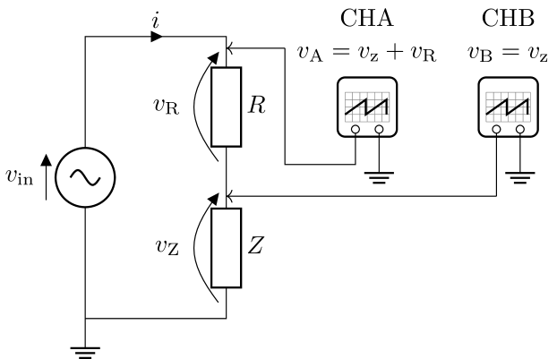
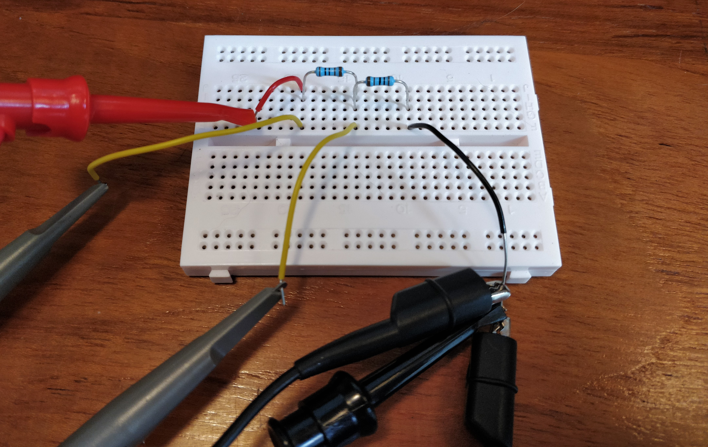
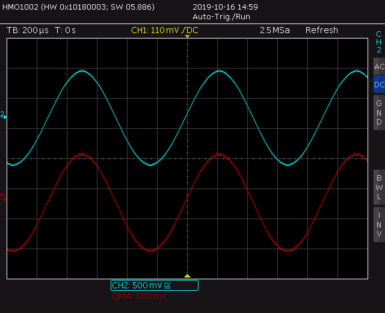

# Analysis and Design of Circuits Lab
# Part 1: Autumn Term weeks 4--6

The lab exercise for Analysis and Design of Circuits Part 1 concerns passive components: resistors, capacitors and inductors.
In this section, you'll find out how you can measure impedance.
[Section 2](Section2.md) is about the impedance of capacitors and inductors, both in theory and in practice.
Finally, in [Section 3](Section3.md) you will use passive components to build filters that can shape the frequency content of a signal.

## Section 1: Measuring Impedance

According to Ohm's law, impedance is the relationship between voltage and current, so if we measure the voltage across a component and the current through it we can calculate its impedance $Z$.
However, the oscilloscope measures voltage not current, so instead we can add a series resistor $R$, which has a known, dependable relationship between voltage and current:
		

		
Now, we can measure the voltage across $R$, which is $v_\text{R}$, and the voltage across $Z$, which is $v_\text{Z}$. Since $Z=v_\text{Z}/i$ and $i=v_\text{R}/R$, $Z=Rv_\text{Z}/v_\text{R}$.
		
There is a problem with using this method.
The two channels on the oscilloscope measure voltage referenced to ground, which is defined as the node indicated ⏚, thanks to the internal connection between the signal generator ( $v_\text{in}$ ) and the oscilloscope.
So it's impossible to connect a probe across $R$ to measure $v_\text{R}$ directly, it would just create a short circuit to ground across $Z$.
		

		
The problem can be resolved by measuring $v_\text{A}=v_\text{Z}+v_\text{R}$ and asking the oscilloscope to calculate $v_\text{R}=v_\text{A}-v_\text{Z}$.
That way, both oscilloscope channels are measuring a voltage referenced to ground.
Create the circuit on a breadboard with $Z=R=1\text{kΩ}$.
Connect oscilloscope CHA to measure $v_\text{A}$ (which is also $v_\text{in}$ ) and CHB to $v_\text{Z}$ with the probes.
Set the switches on both probes to the ×10 position and configure the oscilloscope for a ×10 probe on both channels.
		
Generate $v_\text{in}$ from the signal generator with $f=100$Hz, amplitude $v_\text{in}=1V$ and offset 0V.
The voltage source in the circuit will be a sine function because that will be important when we come to characterise capacitors and inductors.
Set the timebase to 5ms/div.
Place the trigger diamond in the centre of the CHA (blue) waveform and set the trigger mode to Auto, Trigger Channel A.
		

		
Calculate and display $v_\text{R}$ on the oscilloscope by pressing `MATH` and setting the options at the right hand side of the screen to CH1, SUB and CH2. You can now remove CH1 from the screen by pressing `CH1` twice — it will still be used by the oscilloscope to calculate the MATH trace and to determine the trigger.
Since $Z$ and $R$ are identical, $v_\text{R}$ (red trace) and $v_\text{Z}$ (blue trace) should be the same.
		

		
- [ ] Set up the oscilloscope to compare $v_\text{Z}$ and $v_\text{R}$. Confirm that $v_\text{Z}=v_\text{R}$ when $Z=R$.

When $v_1\neq v_2$ you'll need to take measurements of both amplitudes and calculate using $Z=Rv_\text{Z}/v_\text{R}$, since $Z=v_\text{Z}/i$ and $i=v_\text{R}/R$.
On the oscilloscope, it's more accurate to make peak-to-peak measurements with cursors because it's easier to align them with peaks of the waveform than the centre.
You will calculating the ratio of amplitudes, so it doesn't matter if you use peak-to-peak amplitude instead of true amplitude as long as you are consistent.
		
Using the cursors can be laborious so the oscilloscope provides some automatic measurement functions.
However, it's important to examine what exactly these are measuring. Press `AUTO MEASURE` to turn on measurements.
You can add up to six measurements to the screen and the side menu lets you choose which measurement number, it's source (e.g. CH1, CH2, MATH) and the measurement type.
Add the measurements 'Amplitude', 'Peak-peak' and 'RMS' for channels MATH ( $v_\text{R}$ ) and CH2 ( $v_\text{Z}$ ).

Compare the measurements and find which ones match peak-to-peak measurements made by the cursors. 
You will find that 'amplitude' and 'peak-peak' are similar because oscilloscopes tend to use the terms interchangeably and not consider true amplitude at all.
On the Rohde and Schwarz oscilloscope, 'amplitude' is more accurate than 'peak-peak' because it uses an algorithm to filter out any noise spikes that might be superimposed on your signal.
		
- [ ] Check the accuracy of the auto measure functions of the oscilloscope by comparing to cursor and multimeter measurements.

## Challenge: source impedance of the signal generator

The signal generator output has a certain *source impedance*, which means it has an equivalent circuit that looks like this:
			

			
Measure the value of $R_\text{source}$ by connecting a load resistance $R_\text{load}$ across the output and measuring the signal amplitude $v_\text{out}$.
Leave the signal generator amplitude, represented here by $V_\text{source}$, at a constant value:
			

			
Take measurements with $R_\text{load}=10\text{kΩ}$ and $R_\text{load}=200\Omega$.
Using the equation for a potential divider, your voltage measurements satisfy the equation:
$$v_\text{out}=v_\text{source}\frac{R_\text{load}}{R_\text{load} + R_\text{source}}$$
You should be able to find $R_\text{source}$ by writing out the expression for each value of $R_\text{load}$ and its respective measurement of $v_\text{out}$, and solving as a pair of simultaneous equations.
