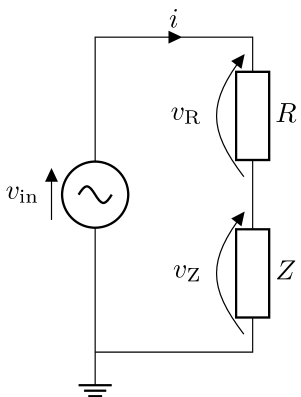
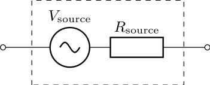

# Analysis and Design of Circuits Lab
# Part 1: Autumn Term weeks 4--6

## Introduction

The lab exercise for Analysis and Design of Circuits Part 1 concerns passive components: resistors, capacitors and inductors.
In this section, you'll find out how you can measure impedance.
Section 2 is about the impedance of capacitors and inductors, both in theory and in practice.
Finally, in Section 3 you will use passive components to build filters that can shape the frequency content of a signal.
	
## Measuring Impedance

According to Ohm's law, impedance is the relationship between voltage and current, so if we measure the voltage across a component and the current through it we can calculate its impedance $Z$.
However, the oscilloscope measures voltage not current, so instead we can add a series resistor $R$, which has a known, dependable relationship between voltage and current:
		

		
Now, we can measure the voltage across $R$, which is $v_\text{R}$, and the voltage across $Z$, which is $v_\text{Z}$. Since $Z=v_\text{Z}/i$ and $i=v_\text{R}/R$, $Z=Rv_\text{Z}/v_\text{R}$.
		
There is a problem with using this method.
The two channels on the oscilloscope measure voltage referenced to ground, which is defined as the node indicated ⏚, thanks to the internal connection between the signal generator ( $v_\text{in}$ ) and the oscilloscope.
So it's impossible to connect a probe across $R$ to measure $v_\text{R}$ directly, it would just create a short circuit to ground across $Z$.
		

		
The problem can be resolved by measuring $v_\text{A}=v_\text{Z}+v_\text{R}$ and asking the oscilloscope to calculate $v_\text{R}=v_\text{A}-v_\text{Z}$.
That way, both oscilloscope channels are measuring a voltage referenced to ground.
Create the circuit on a breadboard with $Z=R=1\text{kΩ}$.
Connect oscilloscope CHA to measure $v_\text{A}$ (which is also $v_\text{in}$ ) and CHB to $v_\text{Z}$ with the probes.
Set the switches on both probes to the $\times1$ position and use the channel configuration on the Picoscope software to set the probe as $\times1$.
		
Generate $v_\text{in}$ from the signal generator with $f=100$Hz, amplitude $v_\text{in}=1V$ and offset 0V.
The voltage source in the circuit will be a sine function because that will be important when we come to characterise capacitors and inductors.
Set the sensitivities of both channels to Auto and the timebase to 5ms/div.
Place the trigger diamond in the centre of the CHA (blue) waveform and set the trigger mode to Auto, Trigger Channel A.
		
		\noindent\includegraphics[width=0.9\textwidth]{graphics/PN-breadboard.jpg}
		
Calculate and display $v_\text{R}$ on the oscilloscope by opening the settings in Tools → Math Channels and enabling the option for A - B.
Click OK and you will see a new waveform on the screen in a purple colour.
If you are using a Mac, download the file \texttt{math\_ch.pssettings} from the lab downloads and open it with the PicoScope software.

The original CHA ( $v_\text{A}=v_\text{R}+v_\text{Z}$ ) on the blue trace is not needed for viewing any longer, but it still needs to be measured to calculate the math channel.
Move it out of the way by setting the display scale for channel A to $\times0.1$ in the little blue box in the bottom left hand corner of the display and dragging its origin on the vertical scale upwards.
Since $Z$ and $R$ are identical, $v_\text{R}$ (purple trace) and $v_\text{Z}$ (red trace) should be the same. 
		
		\noindent\includegraphics[width=0.9\textwidth]{graphics/PN-mathpico}
		
		{\footnotesize\emph{Picoscope set up to show $v_\text{R}$ on the math channel (purple/middle) and $v_\text{Z}$ (red/bottom) on CHB. CHA (blue/top), showing $v_\text{in}$, is scaled down and moved out of the way. The trigger is set to 0V on CHA.}}
		
- [ ] Set up the oscilloscope to compare $v_\text{Z}$ and $v_\text{R}$. Confirm that $v_\text{Z}=v_\text{R}$ when $Z=R$.

When $v_\text{Z}\neq v_\text{R}$ you'll need to take measurements of both amplitudes and calculate using $Z=Rv_\text{Z}/v_\text{R}$.
Using the cursors can be laborious so the oscilloscope provides some automatic measurement functions.
You can add a measurement to the screen with Measurements → Add Measurement.
For this exercise, use the AC RMS measurement since it averages over the entire waveform.
Peak to Peak might appear useful but it includes any peaks of noise, so it's not always an accurate measurement of the underlying sinusoid.
		
Set up RMS and peak to peak measurements for the channels B and A-B (math).
Compare them to measurements made with the cursors using the conversion $v_\text{RMS}=A/\sqrt{2}$, where A is the amplitude.
Also compare with a voltage measurement from with the multimeter in V∿ mode, which is an RMS measurement.
		
- [ ] Check the accuracy of the auto measure functions of the oscilloscope by comparing to cursor and multimeter measurements.

## Challenge: source impedance of the signal generator

The signal generator output has a certain *source impedance*, which means it has an equivalent circuit that looks like this:
			

			
Measure the value of $R_\text{source}$ by connecting a load resistance $R_\text{load}$ across the output and measuring the signal amplitude $v_\text{out}$.
Leave the signal generator amplitude, represented here by $V_\text{source}$, at a constant value:
			

			
Take measurements with $R_\text{load}=10\text{kΩ}$ and $R_\text{load}=1\text{k}\Omega$.
Using the equation for a potential divider, your voltage measurements satisfy the equation:
$$v_\text{out}=v_\text{source}\frac{R_\text{load}}{R_\text{load} + R_\text{source}}$$
You should be able to find $R_\text{source}$ by writing out the expression for each value of $R_\text{load}$ and its respective measurement of $v_\text{out}$, and solving as a pair of simultaneous equations.
