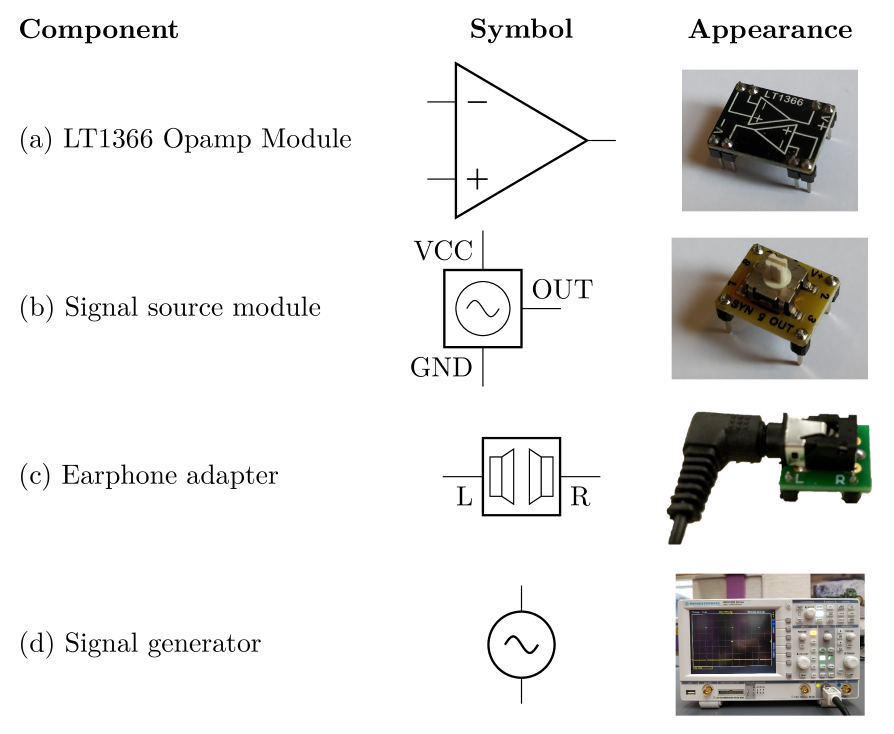
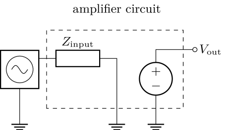
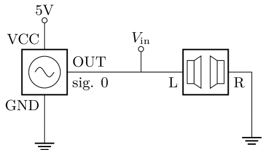
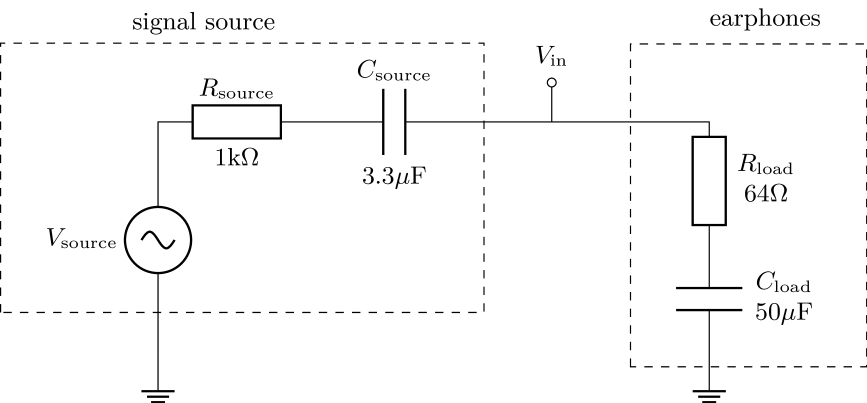
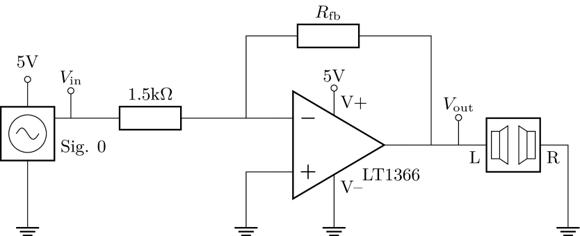
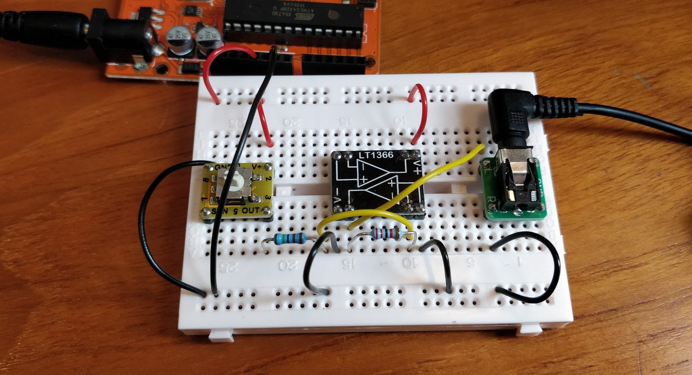
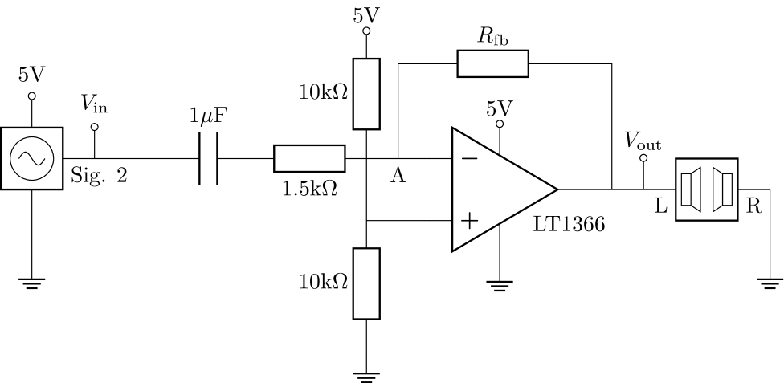
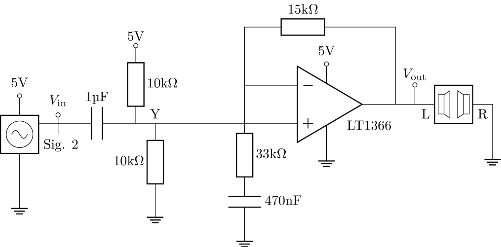
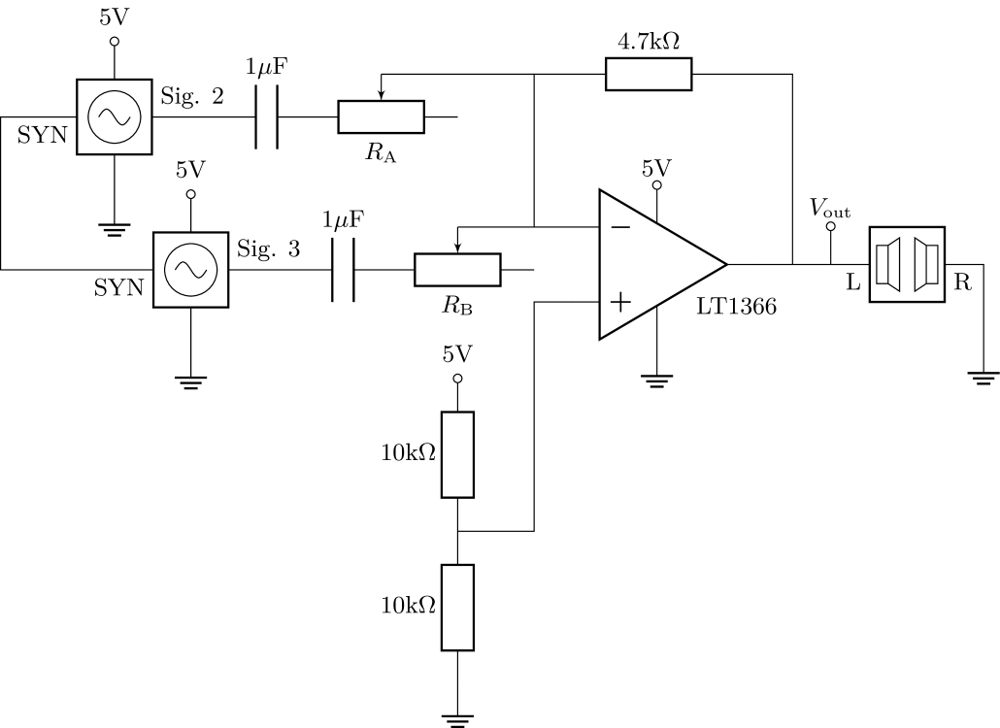

# Analysis and Design of Circuits Lab
# Part 2: Autumn Term weeks 8--10

## Section 1: Biasing and amplification

## Introduction

Opamps are used for amplifying and processing analogue signals.
In this experiment you will build some of the most common opamp circuits.
There are two parts to the experiment and you should allow approximately one lab session for each part, leaving one session for catchup and oral preparation.
				

		
### LT1366 opamp

Opamps are produced by manufacturers to different specification to suit a range of applications.
Since the ideal behaviour of an opamp is a universal concept, these specifications generally define how a particular opamp deviates from the ideal model.
			
You will use the LT1366 opamp module in this experiment (shown in the table above).
The opamp itself is an *integrated circuit* soldered to the bottom of the module.
The module contains some extra components that protect the opamp from damage.
There are two opamps in the LT1366, which have independent inputs and outputs but share the same power supply.
			
The positive power supply to the opamp module should be connected to the V+ pin and the negative supply or ground to V−.
Refer to the diagram printed on the module to connect to the opamp inputs and outputs.
			
The full datasheet for the LT1366 can be found on the [manufacturers website](https://www.analog.com/media/en/technical-documentation/data-sheets/1366fb.pdf) — you will need to refer to it for parts of the experiment.
Refer to the appendix for details about why the LT1366 was selected for this experiment.
			
### Signal source

Opamps usually carry out some sort of signal amplification or processing.
In this experiment you are given a pair of signal source modules (shown in the table above) that can be included on your breadboard to introduce a variety of signals.
			
The module requires a power supply of 5–15V, supplied in the experiment by connections to the positive power rail (V+) and ground (GND).
The output signal is generated on the OUT pin and a SYN pin is used to synchronise the signals from two modules or to provide an oscilloscope trigger.
A rotary switch on the top selects which signal is generated; the options are:			

| Mode | Signal |
| ---- | ------ |
| 0   |	Sine wave |
| 1   |	Noisy sine wave |
| 2   |	Music melody |
| 3   |	Music bass |
| 4   |	Unused |
| 5   |	Unused |
| 6   |	Unused |
| 7   |	Unused |
| 8   |	Melody with whine |
| 9   |	Ground |
			
The SYN pin is used in certain modes to synchronise two signal source modules.
You will be shown when to use it.
Most experiment kits contain one green and one yellow signal source module.
Use the yellow version for all tasks that require just one signal source.
			
## Before the lab

1. Examine the circuit in section.~\ref{s:inv}. Determine a value of feedback resistor $R_\text{fb}$ to produce a voltage gain of $-1.5\pm5\%$.
2. An idealised amplifier circuit can be represented as an input impedance to ground and a voltage source and is shown here connected to a signal source:

Determine the theoretical input impedance $Z_\text{input}$ of the circuits in sections ~\ref{s:ssinv} and ~\ref{s:ssnoninv}.
  Remember that the opamp itself has an (ideally) infinite impedance at the input pins so any finite impedance must originate from the other components in the circuit.
  Use the virtual ground approximation in the case of the inverting amplifier.
  A voltage source such as the 5V power supply can be considered as short circuit to ground.

## Signal source

This experiment uses opamps to process signals generated by signal source modules and amplify them so they can be heard on pairs of earphones.
First, find out what happens if the signal source module is connected directly to the earphones.
The diagram below shows how to make the connection between the two modules.
Note that the earphone adapter has a GND connection that is unused in this experiment; just use L and R. 

			
Use the 5V voltage source in the Orangepip to power the signal source module.
Move the rotary switch on the signal source module to position 0, which generates a sine wave.
Plug the earphones into the socket on the adapter module, power the circuit and listen carefully.
			
- [ ] Test the performance of the signal source module without amplification.
			
Clearly some amplification is needed to make the sound louder.
Measure the signal amplitude from the signal source at $V_\text{in}$ with and without the earphones connected.
Without the earphones the amplitude is reasonably large (500mV amplitude is sufficient to drive the earphones loudly) but the signal source cannot provide enough current and the amplitude drops when the circuit is complete.
			
The next diagram shows an equivalent circuit for what you have built.
The earphones have a predominantly resistive impedance of 64Ω (32Ω per channel, connected in series) and the adapter module contains 50µF of series capacitance to prevent the earphones being damaged by DC current.
The signal source module has an equivalent circuit made of $V_\text{source}$, $R_\text{source}$ and $C_\text{source}$. $R_\text{source}$ and $C_\text{source}$ form the *output impedance* of the signal source.

When the earphone is connected, the current flowing in the earphones results in a voltage drop across $V_\text{source}$ and $C_\text{source}$.
This results in the reduction that you can measure at $V_\text{in}$ and the quiet sound.
Put another way, most of the power produced by the signal source is dissipated in its own internal resistance and not the earphone.
			
Confirm that the change in $V_\text{in}$ when the earphones are connected is consistent with the values of $R_\text{source}$ and $R_\text{load}$, assuming the frequency is high and the impedance of both capacitors in negligible.
			
- [ ] Test the performance of the signal source module without amplification.	Confirm the effect of the earphone load on the amplitude of $V_\text{in}$.

## Inverting amplifier

An amplifier can help make the signal louder in three ways:
1. It adds gain so that output voltage amplitude is larger than the input amplitude.
2. It has a higher input or load impedance than the earphones, so there is a smaller reduction in $V_\text{in}$ when it is connected.
3. It has a lower output or source impedance than the signal source module, so it can supply the current required by the earphones without a reduction in amplitude.

Use the opamp module to build an inverting amplifier, shown in the circuit below.
Place the opamp module in the centre of the breadboard and observe the markings to find how the pins connect to the opamps.
		    

			
Your circuit should look similar to this:
			

			
Connect Oscilloscope CH1 to $V_\text{in}$ and CH2 to $V_\text{out}$ to observe the effect of the amplifier.
You will see that positive parts of the output waveform are amplified by $1.5\times$ but the negative parts are missing and the sound is louder but distorted.
We will address this in the next section.
		
- [ ] Build the inverting amplifier and check the output waveform
		
## Single supply Inverting amplifier

The original inverting amplifier circuit does not work correctly and the lower part of the output signal is missing.
The reason is that the opamp can't produce an output lower than the negative power supply (V− pin), which is 0V in this circuit.
			
It is possible to use a second power supply with a negative voltage to fix this problem.
However, you do not have a second power supply so another solution is needed.
This is a common scenario because it would be expensive to add a second power supply to many systems.
			
The circuit below has two modifications from the original inverting amplifier.
First, the non-inverting input of the opamp is connected to a 2.5V reference voltage created by a potential divider.
This introduces a 2.5V DC bias to the circuit, which the opamp matches by driving the inverting input at node A to 2.5V.
In effect, the virtual ground node has become a virtual 2.5V source.
			
The second modification is the addition of a series capacitor between the signal source and the amplifier.
This blocks the DC voltage of the signal source and allows the AC part of the signal to pass.
It acts a barrier between the signal source with its DC offset of 0V and the opamp circuit with its DC offset of 2.5V.
The time constant of the 1μF capacitor and the 1.5kΩ resistor (the input impedance of the circuit) is 1.5ms, which creates a high-pass filter with a corner frequency of around 100Hz — this is the lower range of the frequencies generated by the signal source.
			

				
When you measure the output of the opamp you will see the offset of 2.5V added to the signal.
You can remove the offset by setting the oscilloscope channel to AC mode.
Then you can measure the amplitude of the output, compare it to the input and find the gain.
		
- [ ] Modify the inverting amplifier so it works correctly and check that the three requirements at the start of section~\ref{s:inv} have been achieved.
		
## Single-supply Non-inverting amplifier

Build a non-inverting amplifier according to this circuit:

			
This circuit also has some features that allow it to work with a single 5V power supply.
There are two 10kΩ resistors used as a potential divider to bias the input signal at node Y to 2.5V and, like before, a 1μF capacitor is used to isolate the 0V offset of the signal input and the 2.5V offset of the amplifier.
			
The 470nF capacitor is used to preserve the 2.5V DC offset at the output.
If the 33kΩ resistor connected directly to ground then the offset would be amplified along with the signal, which would be unhelpful because the peak of the signal might exceed the 5V supply.
The capacitor acts like an open circuit for a DC voltage, so the amplifier has a gain of $15/33+1=1.45$ for the AC signal and a gain of $15/\infty+1=1$ for the DC offset.
The circuit is linear because output is directly proportional to input for a given ω, which means that it's valid to use superposition to consider AC and DC sepeartely, and sum the results together.
			
Both capacitors in the circuit block DC and pass AC, so they form high-pass filters.
The values are chosen to place the corner frequency at or below 100Hz.
				
- [ ]	Build and test the single-supply, non-inverting amplifier.

## Challenge: audio mixer

Modes 2 and 3 of the signal source play the left and right hand parts of a piece of piano music.
Listen to them by using your amplifier and changing the mode switch.
The inverting amplifier can be extended with additional inputs to sum the two parts together, as shown below.

				
Build a summing amplifier with two signal sources, one in mode 2 and the other in mode 3.
Note the wire making the SYN connection between the two source modules, which is used to synchronise the two parts of the music.
				
Potentiometers $R_\text A$ and $R_\text B$ set the gain independently for each input.
Choose the values so that the overall amplitude of $V_\text{out}$ is around 1V and the mix of the music sounds good.

