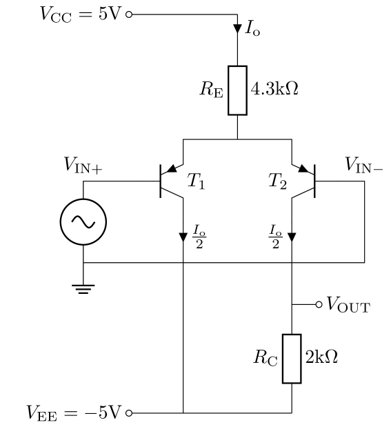
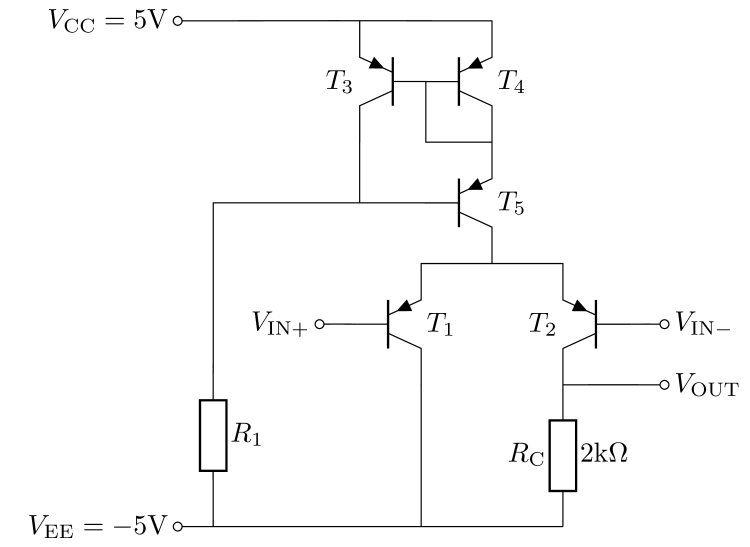
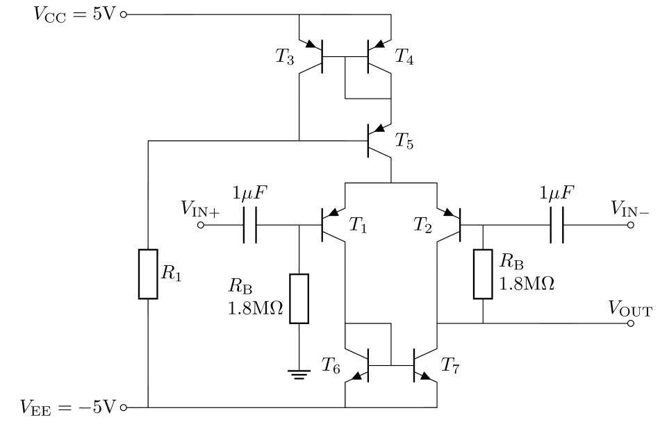

# Analysis and Design of Circuits Lab
# Part 4: Spring Term weeks 7–10

## Differential Amplifier

An opamp amplifies a differential signal: the difference between the inverting and non-inverting inputs.
It should not amplify a *common mode* signal that is applied equally to both inputs.
A circuit with high differential mode gain but low common mode gain is the long tailed pair (LTP):

        
With $V_{\text{IN}+} = V_{\text{IN}-}$, $I_\text{C}$ through $T_1$ and $T_2$ is the same.
However, a slight difference between the inputs causes a large imbalance in $I_\text{C}$ between the transistors, which results in a change to $V_\text{OUT}$.
A common mode input also causes a change in $V_\text{OUT}$, but the gain is smaller due to the emitter degeneration from $R_\text{E}$.

### Gain and Input Resistance

The theoretical gain of the LTP from the small signal model is:
            
$$A_\text{d} = \frac{v_\text{o}}{v_\text{d}} = \frac{g_\text{m,T2}}{2} \left( \frac{1}{r_\text{o,T2}} + \frac{1}{R_\text{C}}  \right)^{-1}$$
      
$v_\text{d}$ is the differential input voltage, $v_\text{d}=v_\text{+}-v_\text{-}$.
In quiescent conditions with $V_{\text{IN}+} = V_{\text{IN}-}=0$, the circuit is biased with a combined collector current $I_\text{o}=1\text{mA}$.
The DC output voltage is therefore around −4V, which is about the level we need to directly couple it to the input of the Darlington pair.
            
- [ ] Enter the LTP ciruit in LTspice and perform an AC analysis to find the differential gain. Compare to the theoretical gain.
            
The differential input resistance of the circuit from the small signal model is:

$$r_\text{ind} = 2 r_\text{be} = \frac{2\beta}{g_\text{m}}$$
            
- [ ] Add a 10kΩ resistor in series with the base of $T_1$ (you also change the source resistance of $V_\text{IN}$) and use the change in differential gain to find the differential input resistance.
            
### Common mode Voltage Gain and Common Mode Rejection Ratio

The input stage should have a small common mode voltage gain. The small signal model gives:

$$A_\text{c} = \frac{v_\text{o}}{v_\text{c}} = -\frac{R_\text{C}}{2R_\text{E}}$$
            
Find the common mode gain in simulation by connecting $V_\text{IN-}$ to $V_\text{IN+}$ instead of ground, and performing an AC analysis
            
- [ ] Find the common mode gain
            
A more useful figure is the ratio of differential gain to common mode gain, the *common mode rejection ratio* (CMRR).
The small signal model for this circuit gives:
            
$$\text{CMRR} = \frac{A_\text{d}}{A_\text{c}} = g_\text{m}R_\text{E} = \frac{R_\text{E}I\text{o}}{2V_\text{T}}$$
            
It is normally quoted in dB in opamp datasheets.
            
- [ ] What is the CMRR of your circuit?
            
### Increasing CMRR and gain with active load
            
The small signal model shows that CMRR can be increased by increasing $I_\text{o}$ or $R_\text{E}$.
Using a larger resistor or greater $V_\text{CC}$ has the same drawbacks as it did for the common emitter stage so, once again, a better solution is to replace the resistor with an active load.
A Wilson current mirror gives a very high output resistance:

            
Choose $R_1$ to give $I_\text{o} = 1\text{mA}$.
            
- [ ] What is the CMRR of the LTP with active load?
            
The overall gain of the LTP, both common mode and differential, increases with $R_\text{C}$.
A current mirror can also be used here to increase the gain.
However, instead of setting it up as a constant current source using a resistor, we can use the mirror to reflect the current from the unused leg of the LTP back into the output:

            
The second current mirror acts to resist the imbalance in current between the two legs.
Hence, a small differential input voltage results in a large change in $V_\text{OUT}$ as the LTP fights the current mirror.
The circuit also has the advantage of using the unused signal current in the left hand leg of the LTP to boost the output.
A biasing resistor and blocking capacitor are added to each base to add DC stability for testing purposes.
            
Small signal analysis now gives the differential gain as:
            
$$A_\text{d} = g_\text{m,T2}\left( \frac{1}{r_\text{o,T2}} + \frac{1}{r_\text{o,T7}} + \frac{1}{R_\text{B}}  \right)^{-1}$$
            
- [ ] Measure the differential gain with the addition of the second current mirror
