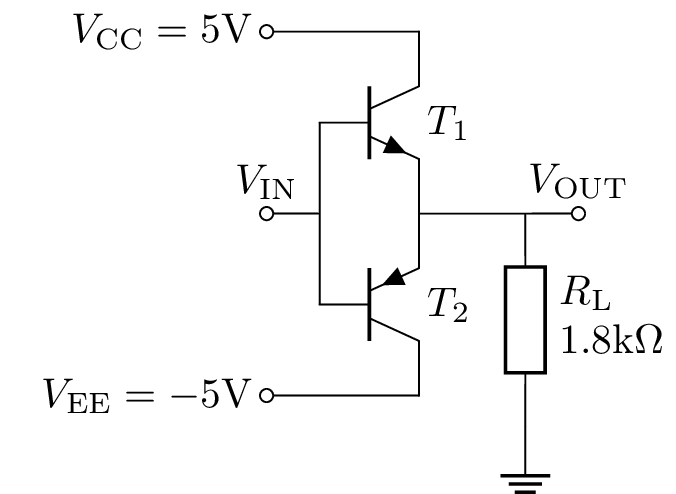
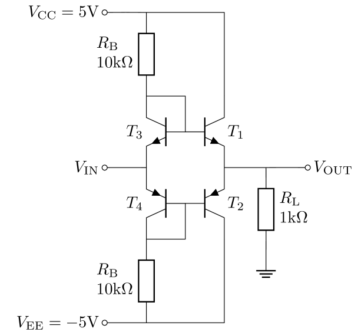
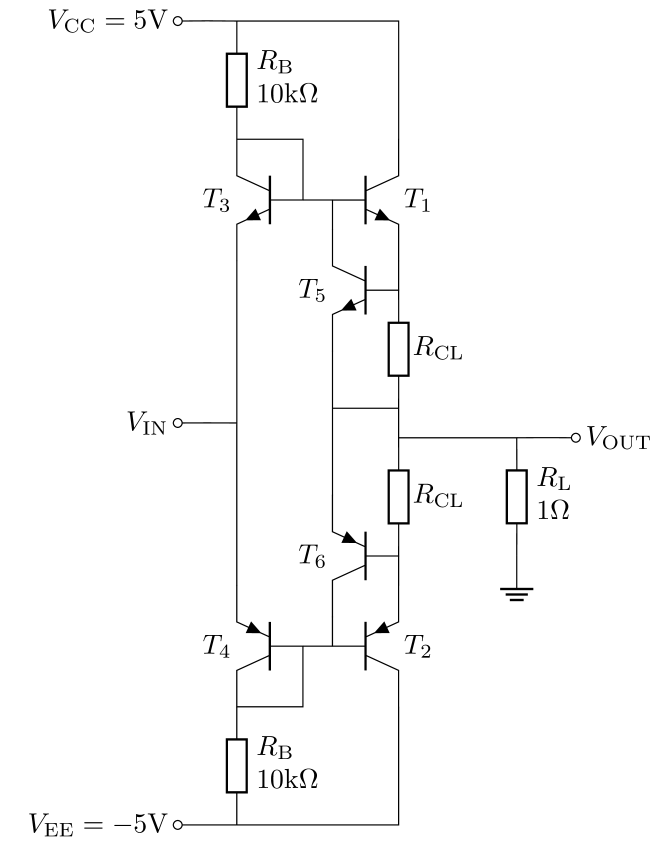

# Analysis and Design of Circuits Lab
# Part 4: Spring Term weeks 7–10

## Power Amplifier (Output) Stage

The opamp should have a low output resistance so that it can drive enough current to meet the requirements of the external circuit.
This is achieved with a power amplifier, the simplest of which is the class B push-pull common collector amplifier:

        
The base-emitter junctions between input and output ensure that the output tracks the input with unity voltage gain.
Meanwhile, the direct connection of the output to the supplies via the output transistors means that the circuit can sink or source a large amount of current with little output resistance over a large voltage range.
        
### Crossover Distortion

The disadvantage of the class B amplifier is that both transistors are in cutoff for $\|V_\text{OUT}-V_\text{IN}\| < 0.55\text{V}$.
This means that the quiescent current is very low because no current flows between the power rails while the output is stationary.
However, when the output current switches direction there is a dead zone where neither transistor conducts and the output waveform exhibits crossover distortion.
            
View the crossover distortion by setting the circuit up for a transient analysis.
Connect a sinusoidal voltage source to $V_\text{IN}$ with an amplitude of 1V and a frequency of 1kHz.
Run the transient simulation for 5ms and plot the voltages at $V_\text{IN}$ and $V_\text{OUT}$.
            
- [ ] View the output waveform of the class B amplifier. Try different input amplitudes to characterise the gain of the circuit.
        
The crossover distortion can be fixed by adding diode-connected transistors to offset the base voltage of each output transistor such that they are always in the active region.
This is called a class AB amplifier:

            
If the transistors are well matched then the quiescent collector currents will be the same — note how the circuit is back to back current mirrors.
Therefore, the bias resistors $R_\text{B}$ set the bias current in the output transistors and ensure that they remain in the active region.
            
- [ ] Simulate the class AB amplifier with a transient analysis and compare the magnitude of the crossover distortion with the class B amplifier.

### Current and voltage limits
            
The basic class A or class AB power amplifiers are susceptible to permanent damage if output is accidentally shorted to ground, or the load impedance is too low.
If the output is shorted then the $V_\text{BE}$ of the output transistors could exceed 0.7V and the collector current will only be limited by $r_\text{o}$.
This circuit adds current limiting to a class AB amplifier:
    

                
The circuit uses two additional transistors, $T_5$ and $T_6$, and two resistors.
Consider that $V_\text{IN}$ is positive, so $T_1$ is sourcing (pushing) a positive current to the load at $V_\text{OUT}$ to maintain $V_\text{OUT}=V_\text{IN}$.
If the output current increases, the voltage across $R_\text{CL}$ increases, and if that voltage increases enough, $T_5$ will turn on and `rob' the base current from $T_1$. Therefore, the output current cannot increase to more than approximately $0.6/R_\text{CL}$.
            
Find the maximum collector current for each type of transistor and pick the smaller magnitude of the two.
Choose a value of $R_\text{CL}$ that will limit current to half of this value, to allow a safety margin.
Simulate the circuit to find the output waveform with a 1Ω load resistance. Add the collector current of each output transistor to the plot.
        
- [ ] Confirm that the output current is limited to the desired magnitude
            
The use of biasing resistors is not ideal in this amplifier because they result in a low input impedance.
They also impose a limit on the output voltage range — for a large positive or negative $V_\text{IN}$, there is not enough base current available through $R_3$ to provide sufficient output current.
            
- [ ] Observe the output waveform with a 50Ω load resistance and a 2V amplitude of $V_\text{IN}$ amplitude. What is the maximum and minimum output voltage?
            
The limitations of the biasing resistors can be mitigated by replacing them with a current mirror.
However, rather than introduce two new current mirrors, we can share the bias current of the common emitter stage.
You'll see this in the circuit for the complete opamp.
